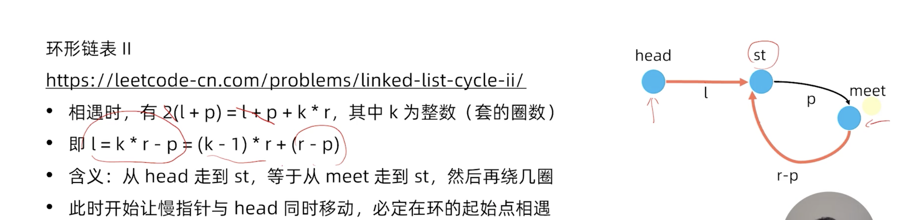

#链表原理

时间复杂度
lookup O(N)
insert O(1)
delete O(1)
append(push back) O(1) 末尾插入
prepend O(1)头部插入

保护节点，为了越界
单链表 - head
双链表 - head + tail

206.反转链表

25. K个一组反转链表

#双链表

邻值查找
给定一个长度为n的序列A，A中的数各不相同
对于A中的每一个数Ai，求i前面于Ai相差最小的数。
以及令上式取到最小值的位置j。
若最小值不唯一，则选择Aj较小的那个

[1,5,3,4,2]
=>i=1, min=0,j=0
=>i=2, min=4,j=1
=>i=3, min=2,j=1
=>i=4, min=1,j=3
=>i=5, min=1,j=1

前驱，后继差值最小
比如4的前驱数3，后继是5
首先排好序，然后找前驱后继，维护有序集合

输入
3
1 5 3
输出 （第一个数字1不管，直接跳过）
4 1
2 1

通过双向链表和数组建立对应关系
https://www.acwing.com/problem/content/138/

141.环形链表
快慢指针，O(n)时间 O(1)空间
有环必定发生套圈（快慢相遇），无环不会发生套圈（快指针走完）

142.环形链表ii 
找出环的起始点，是个数学题

a.先找出相遇点
b.再找出起始点